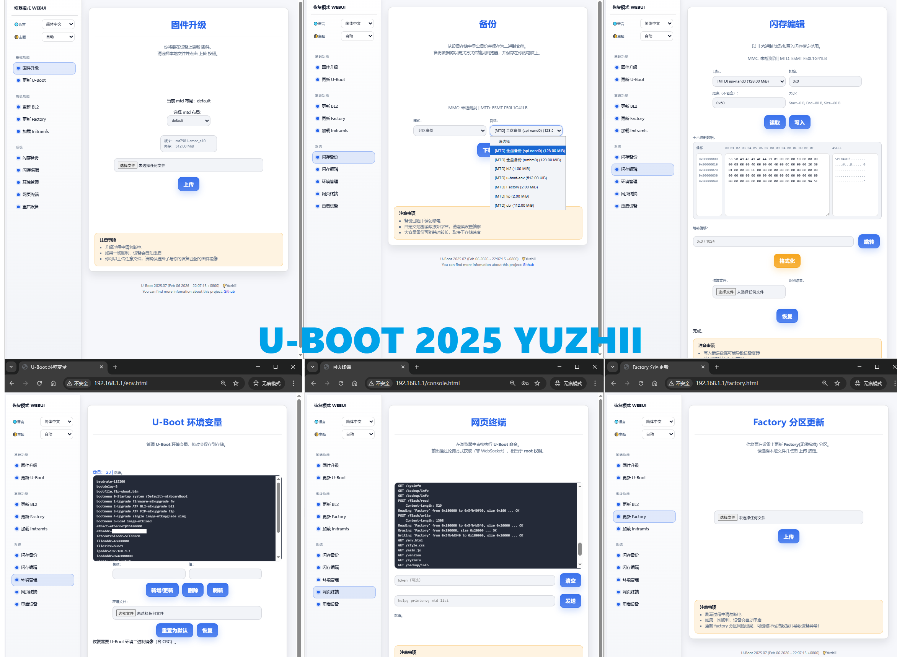

# ATF and u-boot for mt798x with DHCPD

A modified version of hanwckf's U-Boot for MT798x by Yuzhii, with support for DHCPD and a beautiful web UI. 

Supports GitHub Actions for automatic builds, and can generate both normal and overclocked BL2.

**Warnign: Flashing custom bootloaders can brick your device. Proceed with caution and at your own risk.**

**Version 2026 is in beta, please report any issues you encounter.**

## About bl-mt798x

> Version-2026 WEB UI preview

U-Boot 2026 adds more features:

- System info display
- Factory (RF) update
- Backup download
- Flash editor
- Web terminal
- Environment manager
- Device reboot



You can configure the features you need.

- [x] MTK_DHCPD
  - [x] MTK_DHCPD_ENHANCED
  - [x] MTK_DHCPD_USE_CONFIG_IP
  - MTK_DHCPD_POOL_START_HOST default 100
  - MTK_DHCPD_POOL_SIZE default 101
- Failsafe Web UI style:
  - [x] WEBUI_FAILSAFE_UI_NEW
    - [x] WEBUI_FAILSAFE_I18N
  - [ ] WEBUI_FAILSAFE_UI_OLD
- [x] WEBUI_FAILSAFE_ADVANCED - Enable advanced features
  - [x] WEBUI_FAILSAFE_FACTORY - Enable factory (RF) update
  - [x] WEBUI_FAILSAFE_BACKUP - Enable backup download
  - [x] WEBUI_FAILSAFE_ENV - Enable environment manager
  - [x] WEBUI_FAILSAFE_CONSOLE - Enable web terminal
  - [x] WEBUI_FAILSAFE_FLASH - Enable flash editor

> Enable WEBUI_FAILSAFE_UI_OLD will use the traditional webui interface.

## Prepare

```bash
sudo apt install gcc-aarch64-linux-gnu build-essential flex bison libssl-dev device-tree-compiler qemu-user-static
```

## Build

```bash
chmod +x build.sh
BOARD=sn_r1 VERSION=2025 ./build.sh
BOARD=cmcc_a10 VERSION=2025 MULTI_LAYOUT=1 ./build.sh
```

- SOC=mt7981/mt7986 (auto detected. Optional)
- VERSION=2022/2023/2024/2025 (default: 2025. Optional)
- MULTI_LAYOUT (default: 0. Optional, only for multi-layout devices, e.g. xiaomi-wr30u, redmi-ax6000)
- FIXED_MTDPARTS (default: 1. Optional, if set to 0, for nand device, the mtdparts will be editiable, but it may cause some issues if you don't know what you are doing)
- VARIANT=default/ubootmod/nonmbm (default: default. Optional, for different firmware variants, e.g. OpenWrt/ImmortalWrt stock firmware, OpenWrt/ImmortalWrt U-Boot layout firmware, nmbm disabled firmware, etc.)

> CAN'T ENABLE MULTI_LAYOUT=1 and FIXED_MTDPARTS=0 at the same time

| Version | ATF | UBOOT |
| --- | --- | --- |
| 2026 | 20260123 | 20260123 |

Generated files will be in the `output`
